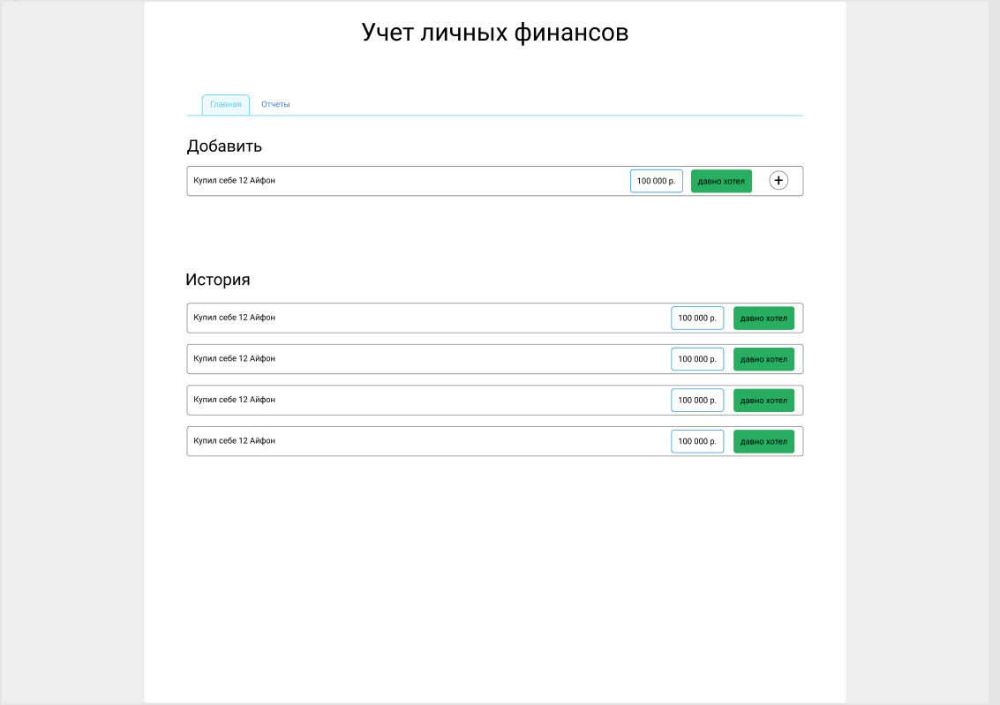

# ok-202105-finrec-at
Учет финансов, Толкачев Алексей

### Целевая аудитория (Приложение по учету личных финансов)
1. Мужчина или женщина от 25 до 50 лет.
2. Высшее образование, склонны планировать и, чаще всего, взвешенно подходить к своим тратам.

### Описание MVP
Возможно 2 вариант реализации:
1. Как бекенд для `веб(spa) или нативного приложения по учету финансов` для всех желающих вести учет личных финансов. В этом варианте происходит запись и учет только трат. Нет заведения первичных остатков и прихода денежных средств.
2. Автоматазиация торговли для малого бизнеса (spa).
   
### Эндпоинты
1. CRUD для движений по счету(в случае учета личных финансов только расход) - `account_movement`, привязанного к счету клиента
2. CRUD  -  счет клиента `account`
3. CRUD категория(метка) `category`

### Модель данных
1. account_movement
    1. id
    2. label
    3. date
    4. category_id(внешний ключ)
    5. value
    6. type (enum: expense | incoming) - в рамках  MVP только `expense`
2. account
    1. id
    2. label
3. category
    1. id
    2. label
